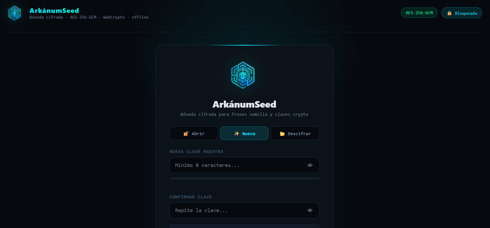

# ArkánumSeed

**Bóveda offline cifrada para seed phrases y claves crypto.**

Un único archivo HTML. Sin servidor. Sin registro. Sin conexión. Funciona en cualquier navegador moderno desde un USB, un disco duro o directamente descargado.

---

## ¿Qué hace?

- Almacena seed phrases (BIP39) y claves xpub/zpub de tus wallets
- Cifrado **AES-256-GCM** con WebCrypto API nativa del navegador
- Derivación de clave con **PBKDF2-SHA256** (600.000 iteraciones)
- Validación de checksum BIP39 antes de guardar
- Exportación cifrada a `.svault` como copia de seguridad
- Modo descifrado standalone: abre un `.svault` sin necesidad de tener la bóveda

## Características de seguridad

- **Zero localStorage** — ningún dato persiste en el navegador
- **Zero dependencias externas** — ni Google Fonts ni CDN de ningún tipo
- **Clave maestra fuerte obligatoria** — 16+ caracteres o frase de 6+ palabras
- Bloqueo automático por inactividad (5 minutos)
- Rate limiting con backoff exponencial contra ataques de fuerza bruta
- DOM limpiado al bloquear — no quedan datos en memoria del renderizado

## Uso

1. Descarga `index.html` (o úsalo directamente desde [GitHub Pages](https://narufortix.github.io/ArkanumSeed/))
2. Ábrelo en tu navegador — **sin conexión a internet**
3. Crea una clave maestra fuerte
4. Añade tus wallets y seed phrases
5. Guarda el HTML (incluye los datos cifrados) o exporta un `.svault`

> **Recomendación**: úsalo desde un USB sin conexión a red. Nunca introduzcas tus seeds en un dispositivo conectado a internet.

## Modos de uso

| Modo | Descripción |
|------|-------------|
| A — Descarga directa | Descarga el HTML, úsalo offline |
| B — HTML + .svault | HTML limpio, datos en fichero `.svault` separado |
| C — HTML autocontenido | Datos cifrados embebidos en el propio HTML |

## Licencia

GPL-3.0 — libre para uso personal. Si distribuyes una versión modificada, debe ser también open source bajo la misma licencia.

## Advertencia legal

Este software se proporciona tal cual, sin garantías de ningún tipo. El usuario es el único responsable de la custodia de sus claves y seed phrases. Una seed phrase perdida es irrecuperable.
